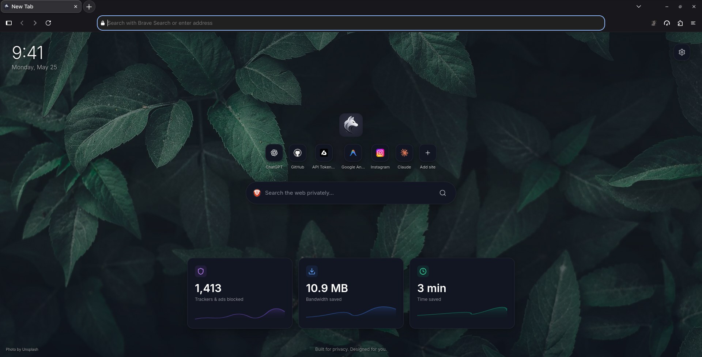

# Lykon Browser

Lykon is a privacy-focused browser forked from Mozilla Firefox with a cleaner default UI, tracker protection, and built-in ad-blocking.



Key highlights:
- Firefox foundation with privacy-first features
- Built-in ad/tracker blocking and a Shield UI
- Fast iteration for front-end and UX changes

Quick build (developer):

```bash
# from repository root
./mach build faster   # front-end only (fast)
./mach run            # run the built browser locally
```

Full build:

```bash
./mach build
```

Prerequisites (typical):
- Python 3.8+
- Rust (for some native components)
- C++ compiler (GCC/Clang) and standard build toolchain
- ~15 GB free disk and 8+ GB RAM recommended

Contributing:

1. Fork the repository and create a branch (`git checkout -b feature/my-feature`)
2. Make changes and test locally (`./mach run`)
3. Commit cleanly and open a PR against main with a description and screenshots

Report bugs and security issues using [SECURITY.md](SECURITY.md).

See [LICENSE](LICENSE) for licensing details.

